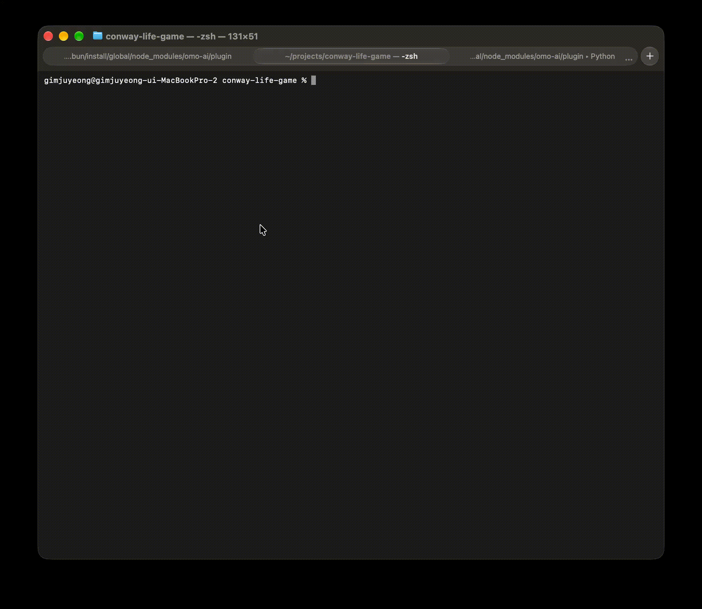

# Conway Life Game

대충 만들어보는 러스트 익숙해지기 게임

- 죽은 칸에 접한 8칸 중 정확히 3칸이 살아 있다면 해당 칸은 그 다음 세대에 살아난다.
- 살아있는 칸과 접한 8칸 중 2칸 혹은 3칸에 세포가 살아 있다면 해당 칸의 세포는 살아있는 상태를 유지한다.
- 그 이외의 경우 해당 칸의 세포는 다음 세대에 고립돼 죽거나 혹은 주위가 너무 복잡해져서 죽는다. 혹은 죽은 상태를 유지한다.

위 조건을 맞춰서, 쓰레딩으로 직접 게임엔진의 생명주기와 렌더링을 터미널 내에서 진행하고, 업데이트가 되도록 만들었습니다.

각 패턴들은 [해당모델](./src/models/pattern.rs) 에서 미리 정의하여, 파싱 후에 [엔진모델](./src/models/engine.rs) 에서 생성되어 세포들의 생명주기가 생성되게 하였습니다.